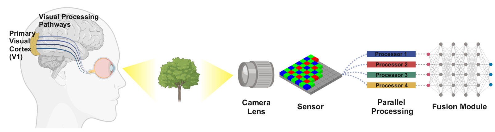
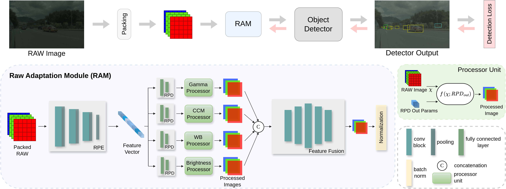

<div align="center">
<h1> [ICCV 2025] Beyond RGB: Adaptive Parallel Processing for RAW Object Detection </h1>

<b>Shani Gamrian<sup>1</sup>, Hila Barel<sup>1</sup>, Feiran Li<sup>1</sup>, Masakazu Yoshimura<sup>2</sup>, Daisuke Iso<sup>1</sup> <br>
<sup>1</sup>Sony AI, <sup>2</sup>Sony Group Corporation

**An official implementation of RAM.**
</b>

[]()
[](https://arxiv.org/abs/2503.13163)
<a href="mailto: shani.gamrian@sony.com">
        
    </a>
</div>

<div align="center">
   
</div>

## 📝 Introduction

Object detection models are typically applied to standard RGB images processed through Image Signal Processing (ISP) pipelines, which are designed to enhance sensor-captured RAW images for human vision. However, these ISP functions can lead to a loss of critical information that may be essential in optimizing for computer vision tasks, such as object detection. In this work, we introduce Raw Adaptation Module (RAM), a module designed to replace the traditional ISP, with parameters optimized specifically for RAW object detection. Inspired by the parallel processing mechanisms of the human visual system, RAM departs from existing learned ISP methods by applying multiple ISP functions in parallel rather than sequentially, allowing for a more comprehensive capture of image features. These processed representations are then fused in a specialized module, which dynamically integrates and optimizes the information for the target task. This novel approach not only leverages the full potential of RAW sensor data but also enables task-specific pre-processing, resulting in superior object detection performance. Our approach outperforms RGB-based methods and achieves state-of-the-art results across diverse RAW image datasets under varying lighting conditions and dynamic ranges.

<div align="center">
   
</div>


## 🖼️ Data

In our paper we trained and evaluated our methods on the following datasets:
- [ROD](https://gitee.com//mindspore/models/tree/master/research/cv/RAOD):
RAW HDR driving scenes datasets (ROD-Day, ROD-Night).

- [NOD](https://github.com/igor-morawski/RAW-NOD): Low-light RAW datasets (NOD-Sony, NOD-Nikon).
- [LOD](https://github.com/ying-fu/LODDataset): Long exposure and short exposure datasets (LOD-Dark, LOD-Normal).
- [PASCALRAW](https://purl.stanford.edu/hq050zr7488): Daylight RAW dataset.

All RAM experiments were performed on RAW data, which was preprocessed by reshaping it into the RGGB representation and saving it 
as `.npy` files before training. 

The code used for converting the RAW images into numpy files is provided <b>[here](preprocess_files)</b>.

For MMDetection training, please arrange the data as follows:
```
ROD_dataset/
        /images/
             /image1.npy
             /image2.npy
             /...
        /annotations/
             /train.json
             /val.json
             /...
```
And modify the `data_root` path in the datasets config file to the desired ROD_dataset (or any other dataset) directory.

We also provide the train/val splits annotations files in MMDetection format <b>[here](annotations)</b>.

## 🎯 Benchmarks
We evaluate our pipeline on various RAW datasets.

**PASCALRAW** (12-bit)

| Model                                                                            | Resolution | Epoch | mAP  | mAP50 | mAP75 | Download                                                                                       |
|----------------------------------------------------------------------------------|------------|-------|------|-------|-------|------------------------------------------------------------------------------------------------|
| [Faster R-CNN R50](configs%2Ffaster-rcnn%2Ffaster-rcnn-r50-fpn-pascalraw-ram.py) | 600X400    | 50    | 68.7 | 93.2  | 82.3  | [model](https://drive.google.com/file/d/1_W3ivhW1jYIked4NZ84NFQaMeIfqdV-a/view?usp=drive_link) |
| [YOLOX-T](configs%2Fyolox-t%2Fyolox-t-pascalraw-ram.py)                          | 600X400    | 170   | 73.8 | 95.1  | 87.1  | [model](https://drive.google.com/file/d/1fdVtJUFELPtdOqy8y7mAdF4adDb3THCd/view?usp=drive_link) |


**NOD-NIKON** (14-bit)

| Model                                                                            | Resolution | Epoch | mAP  | mAP50 | mAP75 | Download                                                                                       |
|----------------------------------------------------------------------------------|------------|-------|------|-------|-------|------------------------------------------------------------------------------------------------|
| [Faster R-CNN R50](configs%2Ffaster-rcnn%2Ffaster-rcnn-r50-fpn-nod_nikon-ram.py) | 600X400    | 30    | 34.2 | 59.4  | 34.2  | [model](https://drive.google.com/file/d/1TBMhuwLsGlqseSc54WulmbEbbAaDmUUz/view?usp=drive_link) |
| [YOLOX-T](configs%2Fyolox-t%2Fyolox-t-nod_nikon-ram.py)                          | 600X400    | 65    | 37.1 | 62.1  | 38.2  | [model](https://drive.google.com/file/d/1B6wG6jD0-tRbA238BQA8H0cBLNg8Soh-/view?usp=drive_link) |


**NOD-SONY** (14-bit)

| Model                                                                           |Resolution | Epoch | mAP  | mAP50 | mAP75 | Download                                                                                       |
|---------------------------------------------------------------------------------|-----------|-------|------|-------|-------|------------------------------------------------------------------------------------------------|
| [Faster R-CNN R50](configs%2Ffaster-rcnn%2Ffaster-rcnn-r50-fpn-nod_sony-ram.py) | 600X400   | 35    | 36.7 | 62.4  | 37.4  | [model](https://drive.google.com/file/d/1lgGGkrnevvkV7tvck1J4CfbSot_qD0Ub/view?usp=drive_link) |
| [YOLOX-T](configs%2Fyolox-t%2Fyolox-t-nod_sony-ram.py)                          | 600X400   | 210   | 39.7 | 63.1  | 41.9  | [model](https://drive.google.com/file/d/1WOQZG4pQMVbAl8fqaEXc00SnEgCSpfp3/view?usp=drive_link) |


**LOD-DARK** (14-bit)

| Model                                                                           | Resolution | Epoch | mAP  | mAP50 | mAP75| Download                                                                                       |
|---------------------------------------------------------------------------------|------------|-------|------|-------|------|------------------------------------------------------------------------------------------------|
| [Faster R-CNN R50](configs%2Ffaster-rcnn%2Ffaster-rcnn-r50-fpn-lod_dark-ram.py) | 600X400    | 95    | 38.1 | 61.7  | 40.6 | [model](https://drive.google.com/file/d/1VHs9evIhu_YkKHyJYqr-BvEaMPJHj-Xd/view?usp=drive_link) |
| [YOLOX-T](configs%2Fyolox-t%2Fyolox-t-lod_dark-ram.py)                          | 600X400    | 130   | 43.9 | 64.8  | 46.8 | [model](https://drive.google.com/file/d/1MH_CbX1qXVBQKVmAZLWzk1IXQtHBjQJT/view?usp=drive_link) |


**ROD - Day & Night** (24-bit)

| Model                                                                      | Resolution | Epoch | DAY/mAP | DAY/mAP50 | NIGHT/mAP | NIGHT/mAP50 | Download                                                                                       |
|----------------------------------------------------------------------------|------------|-------|---------|-----------|-----------|-------------|------------------------------------------------------------------------------------------------|
| [Faster R-CNN R50](configs%2Ffaster-rcnn%2Ffaster-rcnn-r50-fpn-rod-ram.py) | 620x400    | 80    | 33.1    | 57.1      | 46.8      | 70.6        | [model](https://drive.google.com/file/d/1upeMABGva0tjpfaDi_0NZDJbR0dlbugw/view?usp=drive_link) |
| [YOLOX-T](configs%2Fyolox-t%2Fyolox-t-rod-ram.py)                          | 620x400    | 290   | 30.8    | 46.3      | 52.9      | 78.3        | [model](https://drive.google.com/file/d/1k13xKsh8Mc9LX2LHdsSokhQk9X5xhnPt/view?usp=drive_link) |


## 🛠️ Getting Started

The code files in this repository can be easily integrated into any codebase by just adding the code files and 
incorporating the `RawAdaptationModule` class before the backbone:
```python
ram = RawAdaptationModule(functions=['wb', 'ccm', 'gamma', 'brightness'],
                          ffm_params=dict(ffm_type='BN_HG'),
                          clamp_values=True)
```
The following instructions are specifically for 
running our code with MMDetection as reported in the paper.

### Installation

Unfortunately, due to licensing restrictions, we’re unable to share the full code that 
includes MMDetection files. However, the instructions below will guide you on how to 
easily integrate our code into the MMDetection framework.

For MMDetection installation, please follow the commands here:
1. Clone the [MMDetection](https://github.com/open-mmlab/mmdetection) repository and follow their installation instructions.
2. Install the torch version (2.0.1) relevant for your GPU/CUDA: \
`pip install torch==2.0.1 torchvision==0.15.2 torchaudio==2.0.2 --index-url https://download.pytorch.org/whl/cu118` 
3. `pip install -e git+https://github.com/open-mmlab/mmcv.git@987d34b0cf8d6cd8725258332fcfc8c54529b1ab#egg=mmcv`

For integration:
1. Add [ram.py](ram.py), [loading.py](loading.py) and the [datasets](datasets) files to your current code.
2. Make sure the pre-processing module supports RAW inputs. 
3. Define RAM on your desired backbone by adding the following code:
```python
    def __init__(self,
                 ...,
                 preproc_transform=None
                ):

        (... init code)
        
        if preproc_transform:
            preproc_type = preproc_transform.pop("type")
            if preproc_type == "ram":
                self.preproc_transform = RawAdaptationModule(**preproc_transform)
            else:
                raise ValueError(f"Unknown learnable transform type: {preproc_type}")
        else:
            self.preproc_transform = None

            
    def forward(self, x):
        if self.preproc_transform:
            x = self.preproc_transform(x)

        (... forward code)
```
4. Test the model using the provided pre-trained weights to verify that it's working correctly.


<b>⭐ If you run into any issues while using the code, feel free to open an issue, we’ll do our best to help.</b>

### Train Model
1. Make sure the `data_path` in your config file is correct.
2. Run, e.g. `python tools/train.py configs/faster-rcnn/faster-rcnn-r50-fpn-nod_nikon-ram.py`

### Test Model
1. Make sure the `data_path` in your config file is correct.
2. Download the trained model to a `/home/checkpoint` directory.
3. Run, e.g. `python tools/test.py configs/faster-rcnn/faster-rcnn-r50-fpn-nod_nikon-ram.py /home/checkpoint/faster_rcnn-nod_nikon-h400-epoch_30.pth`


## Contact

Please open an issue or contact [Shani Gamrian](mailto:shani.gamrian@sony.com) for any questions.
